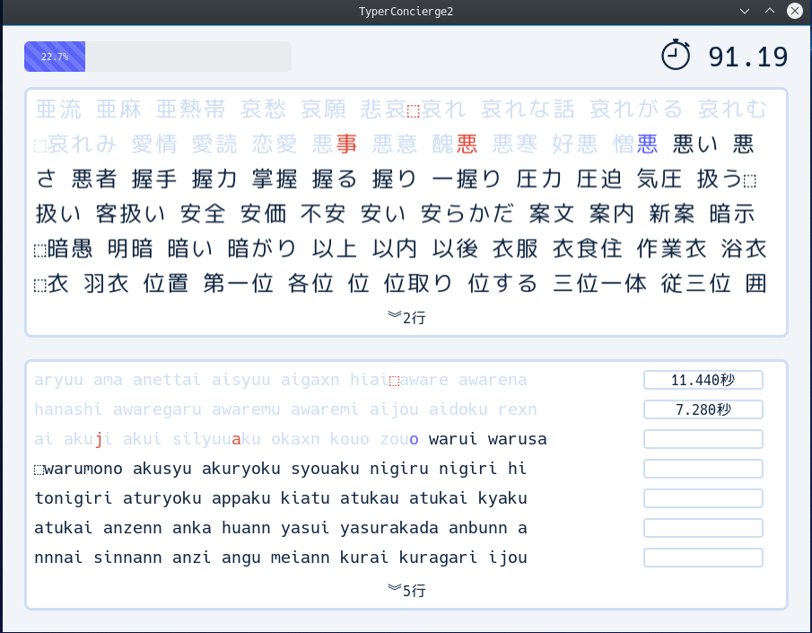

# TyperConcierge2
TyperConcierge2は、クロスプラットフォーム（Windows, OS X, Linux）なタイピングゲームです。



# ユーザー定義辞書について
## フォーマット
### 単語辞書
辞書ファイルは各行に、実際に表示される単語とその読みが書かれています。

#### 各行のフォーマット

行は以下のように、`表示される単語:カンマ（,）区切りの読み`というフォーマットになっています。

```txt
頑張る:がん,ば,る
```

「頑張る」という単語の読みは「がんばる」ですが、１文字目の「頑」は「がん」、２文字目の「張」が「ば」、３文字目の「る」はそのまま「る」という読みとなります。
このように、表示される単語の１文字ずつ（熟字訓の場合を含む場合には1まとまりずつ）に対応する読みをカンマ（,）で区切ったものを各行のコロン（:）の右側に書きます。

以下にいくつかの例を挙げます。

* `ぎょう虫:ぎ,ょ,う,ちゅう` 小さい文字も１文字とします。
* `タイピング:た,い,ぴ,ん,ぐ` 表示される単語がカタカナだった場合でも読みはひらがなとします。
* `[明日]のジョー:あした,の,じ,ょ,ー` 熟字訓は複数文字に対して一つの読みを与えるため、`[]`を用いて1まとまりとします。
* `America:A,m,e,r,i,c,a` 表示される単語が英語だった場合には読みは英語とします。


ただし、カンマ（,）で区切られた読みの数が、表示される単語の文字数と異なっていた場合にはその単語は無効となります。

```txt
頑張る:が,ん,ば,る
```
「頑張る」は３文字ですが、読みは「が・ん・ば・る」と４つのためこの単語は無視されます。

```txt
[明日]の:あ,した,の
```
`[]`で囲まれた部分は1まとまりと見なすため、「明日の」は2つのまとまりですが、読みは「あ・した・の」と3つのためこの単語は無視されます。


#### ファイルのフォーマット
辞書ファイルは、各行に上のようなフォーマットで書かれているプレインテキスト（UTF-8エンコード）となっています。

```txt
頑張る:が,ん,ば,る
ぎょう虫:ぎ,ょ,う,ちゅう
タイピング:た,い,ぴ,ん,ぐ
America:A,m,e,r,i,c,a
```

ファイル名は、「辞書名.tconciergew」とします。
例えば、「四字熟語」という名前の辞書を作りたい場合には「四字熟語.tconciergew」とします。
